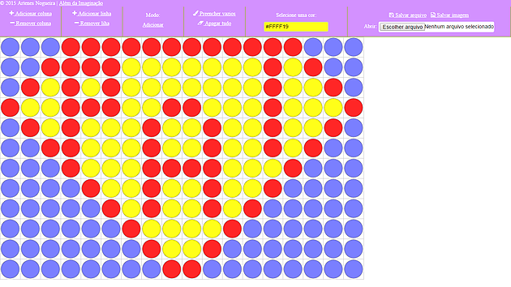
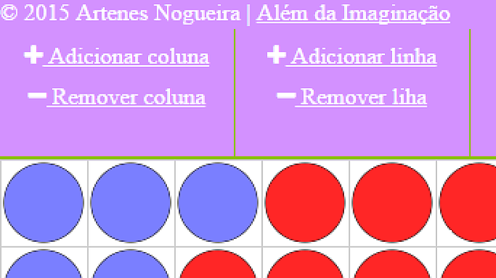
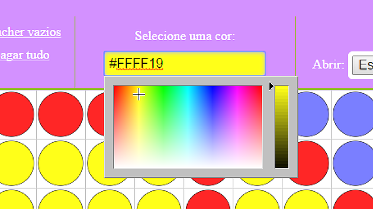
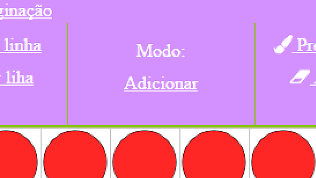
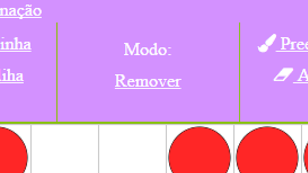
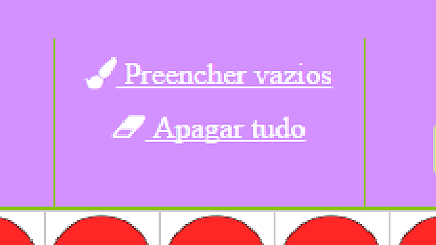
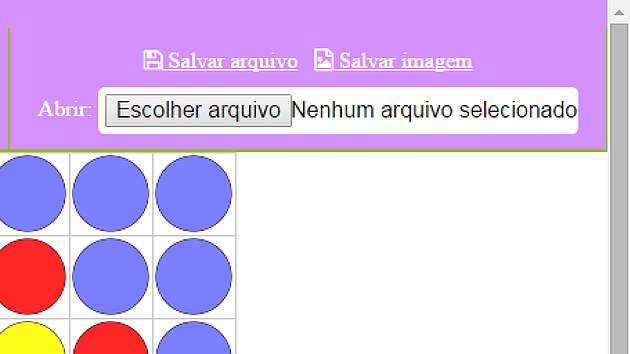

# Balloon Panel Project Builder
A javascript based application to build balloon panel projects. [Check it out working here!](http://artenes.github.io/balloonpanelprojectbuilder/)

# Dependencies 
*(these are the folders that you need in the root)*
* vendor/99Lime/KickStart - CSS Library, download here: http://www.99lime.com/elements/
* vendor/JanOdvarko/jscolor - Javascript Library for color picker, download here: http://jscolor.com/download.php

*These ones you don't need to download, they are being taken from their respectives hosting*
* JQuery - Javascript Library for using Javascript, this one is actually a dependencie for the KickStart Library
* FileSaver - Javascript Library to save files, download here: https://github.com/eligrey/FileSaver.js/
* Blob - Javascript Library to implements the W3C Blob interface in browsers, download here: https://github.com/eligrey/Blob.js
* Canvas-toBlob - Javascript Library to implement the standard HTML5 canvas.toBlob() and canvas.toBlobHD() methods in browsers, download here: https://github.com/eligrey/canvas-toBlob.js

# Credits
Based on the source code of a example from this book: http://diveintohtml5.info/canvas.html

# Tutorial (in portguese)

Sites como o [ESBDE](http://esbde.com.br/) oferecem uma vasta biblioteca de projetos de telas de balões, sendo uma ótima base para quem está começanco a trabalhar na área. Mas o que fazer quando você quiser fazer um projeto mais customizado e que você não encontra exemplos prontos em lugar nenhum? Para isso você precisaria usar programas como o Corel Draw ou Paint, mas seu uso não é tão prático e simples quanto poderia ser. Por isso criamos uma solução mais prática e rápida para contrução de projetos de telas de balões e a melhor parte: é de graça! 
 
O programa ainda está em uma versão inicial, ele é recomendado para construção de projetos simples e para fazer rascunhos rápidos de suas ideias de projetos. Estamos planejando em melhora-la para torná-la uma ferramenta mais versátil.
 
IMPORTANTE: para que o programa funcione, você deve ter javascript habilitado em seu navegador. Caso nada esteja funcionando, isso quer dizer que seu javascript está desabilitado.
 
## Construtor de Projetos de Tela de Balões

 
Neste programa você vai clicando na grade vazia e vai adicionando os balões da cor que você quiser. Você pode expandir a grande tanto em largura quanto em altura. E quando você tiver com seu trabalho pronto basta salvar o projeto como imagem ou como arquivo para ser aberto mais tarde para edição.
 
Vamos dar uma olhada em cada opção do menu:
 
## 1 - Colunas e linhas

Para ajustar o tamanho da grade, ou seja, deixa-la maior ou menor, você precisa clicar nos botões que estão na canto superior esquerdo da tela. O botão adicionar coluna irá aumentar a largura da grade e o adicionar linha vai aumentar a altura. Já os botões de remover coluna e remover linhas irão reduzir a largura e altura da grade, respectivamente.
 
 
## 2 - Seletor de cores

Para escolher a cor com a qual você vai pintar seus balões basta clicar no botão colorido no menu do programa para abrir o painel de seleção de cor. Na parte do painel que parece um arco-íris, você pode clicar e arrastar o sinal de mais para selecionar uma cor. Na parte do painel á direita, você pode mover a seta para mudar o brilho da cor.
 
Toda vez que você clicar em um balão ou em um espaço vazio, o balão será criado ou sua cor vai mudar para a cor que está selecionada nessa opção. 
 
 
## 3 - Modo - Adicionar e Remover
 

Para adicionar balões na grade, o modo precisa estar como Adicionar, assim toda vez que você clicar em um espaço em branco na grade um novo balão vai aparecer.

 

Para remover balões da grade, o modo precisa estar como Remover, assim toda vez que você clicar em um balão na tela, ele irá desaparacer.
 
Se você está no modo Adicionar e quer ir para modo Remover, basta clicar no botão Adicionar que o modo será alterado. Caso você esteja no modo Remover e quer ir para o modo Adicionar, basta clicar no botão Remover que o modo será alterado.
 
## 4 - Preencher e apagar todos

Para agilizar a contrução do porjeto, você pode querer preencher todos os espaços vazios da grade com balões da mesma cor. Basta que você escolha uma cor e então clique no botão Preencher vazios. 
 
Mas caso você queira tirar todos os balões da grade, basta clicar no botão apagar tudo e você poderá começar a trabalhar do zero novamente.
 
## 5 - Salvar e abrir arquivos

Quando você terminar seu projeto, você pode exportá-lo para imagem clicando no botão Salvar imagem. Uma caixa de diálogo vai aparecer pedindo para você dar um nome para o seu projeto. Digite o nome que você quiser e clique em ok. Caso você já tenha digitado o nome uma vez, não será necessário digitar novamente.
 
Caso você ainda não terminou seu projeto e quer continuar mais tarde, você pode clicar no botão Salvar arquivo que irá salvar em seu computador um arquivo .ballpro que você pode abrir mais tarde para continuar a editar seu projeto.
 
Ao clicar em Salvar arquivo uma caixa de dailogo vai aparecer pedindo para você dar um nome para seu projeto. Digite o nome que você quiser e clique em ok. Caso você já tenha digitado o nome uma vez, não será necessário digitar novamente. Toda vez que você salvar em arquivo seu projeto, um novo arquivo será criado.
 
Para abrir seu projeto basta clicar no botão Escolher arquivo e selecionar seu arquivo .ballpro e então seu projeto será carregado no programa.
 
## 6 - O que você acha?
 
Se você tiver um tempo, porque não dizer o que você achou desse programa e o que poderia melhorar? O programa está em uma versão inicial, mas estamos planejando em melhorá-lo e torná-lo mais útil. Estamos abertos para crítiquas, sugestões e dúvidas.
